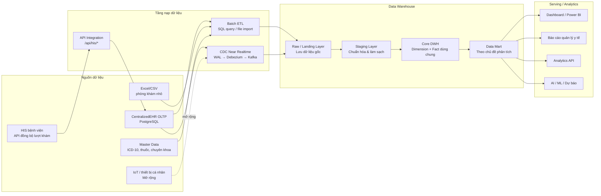
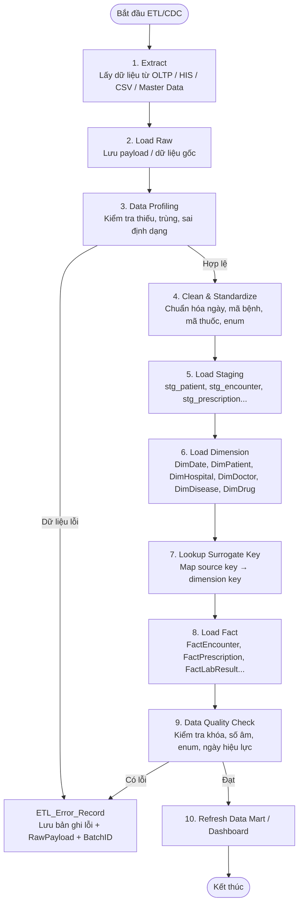
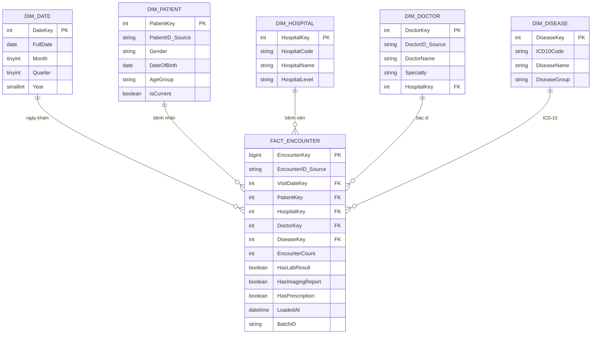
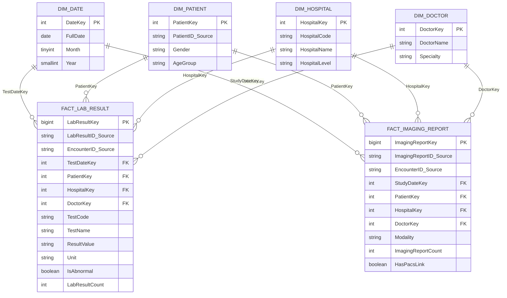
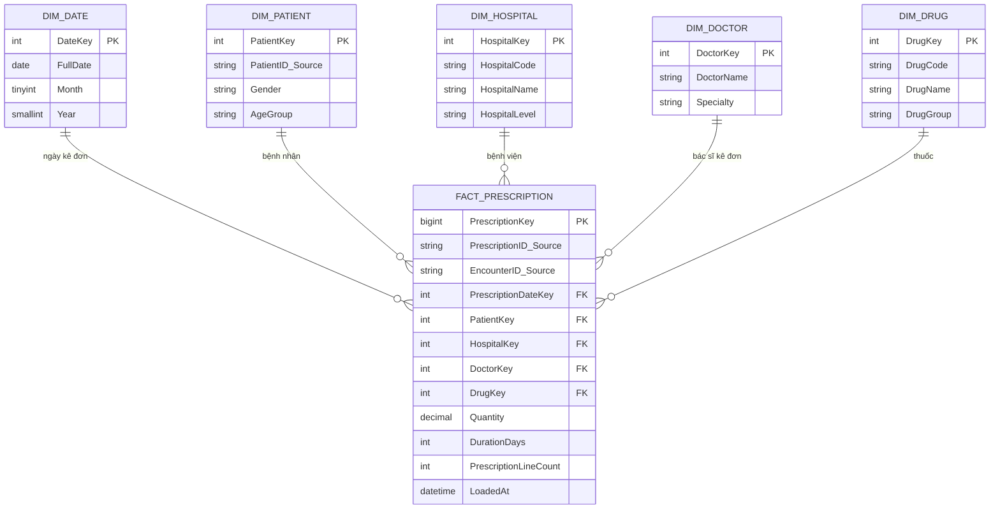
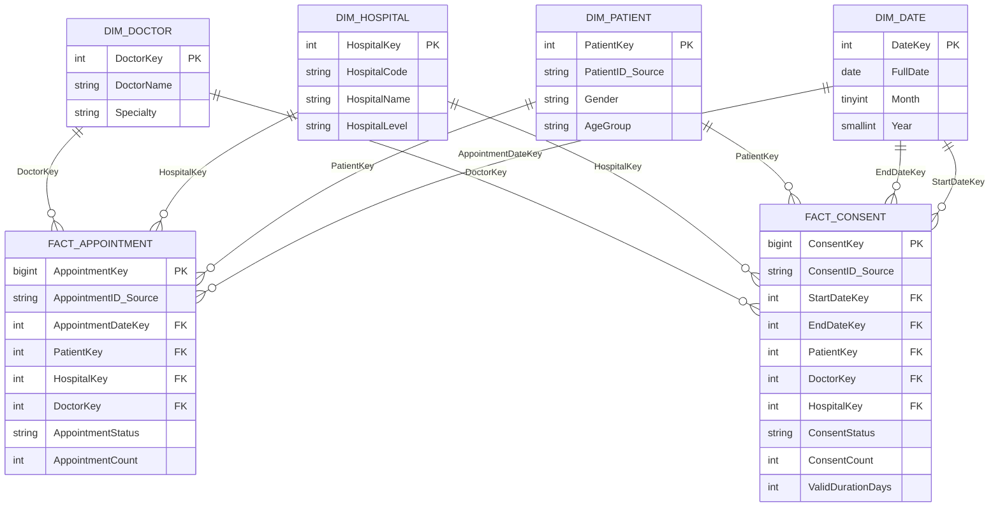
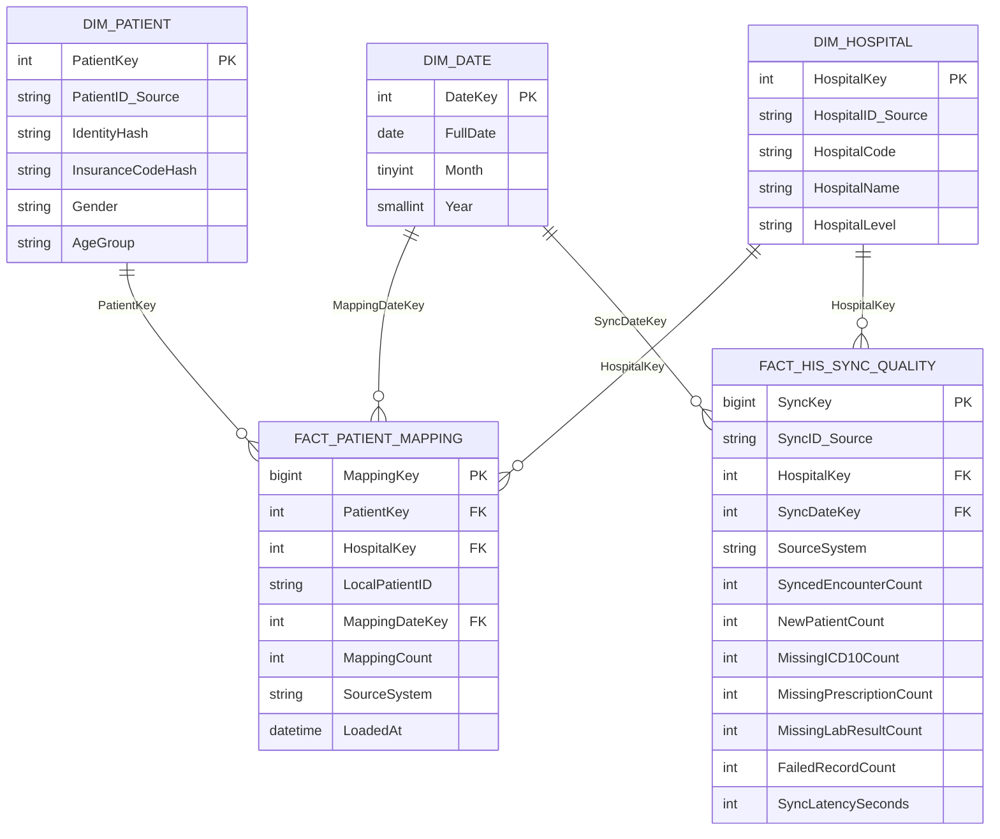
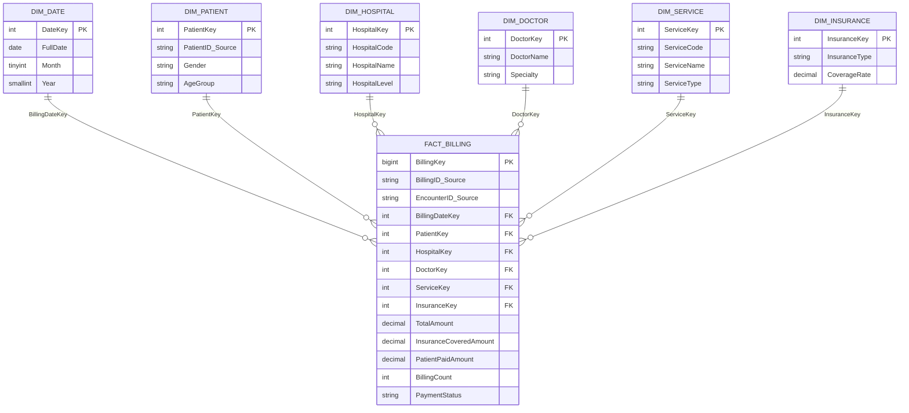
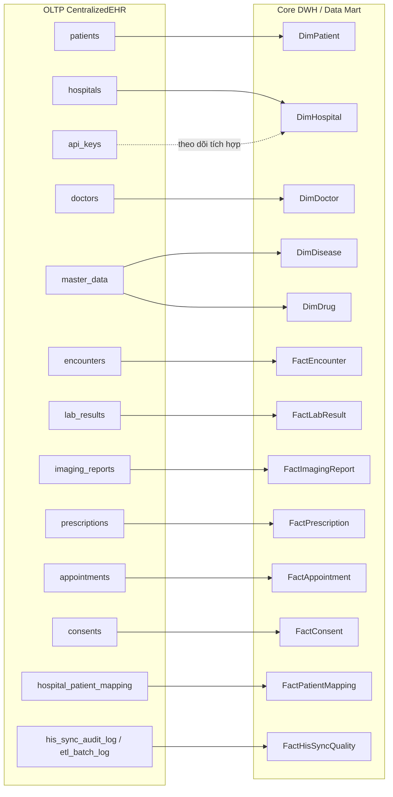

# Bộ sơ đồ chi tiết Data Warehouse cho dự án CentralizedEHR

> Có thể copy các khối `mermaid` vào Markdown, Mermaid Live Editor, GitLab/GitHub, hoặc draw.io bằng Insert → Advanced → Mermaid.

---

## 1. Sơ đồ kiến trúc tổng thể Data Warehouse

---

## 2. Sơ đồ luồng ETL / ELT và kiểm soát chất lượng dữ liệu

---

## 3. Sơ đồ Core DWH tổng hợp

```mermaid
erDiagram
    DIM_DATE {
        int DateKey PK
        date FullDate
        tinyint Day
        tinyint Month
        string MonthName
        tinyint Quarter
        smallint Year
        boolean IsWeekend
    }

    DIM_PATIENT {
        int PatientKey PK
        string PatientID_Source
        string IdentityHash
        string InsuranceCodeHash
        string Gender
        date DateOfBirth
        string AgeGroup
        date CreatedDate
        datetime EffectiveFrom
        datetime EffectiveTo
        boolean IsCurrent
    }

    DIM_HOSPITAL {
        int HospitalKey PK
        string HospitalID_Source
        string HospitalCode
        string HospitalName
        string HospitalLevel
        string Address
        boolean IsActive
    }

    DIM_DOCTOR {
        int DoctorKey PK
        string DoctorID_Source
        string PracticingLicense
        string DoctorName
        string Specialty
        int HospitalKey FK
        datetime EffectiveFrom
        datetime EffectiveTo
        boolean IsCurrent
    }

    DIM_DISEASE {
        int DiseaseKey PK
        string ICD10Code
        string DiseaseName
        string DiseaseGroup
        string Description
    }

    DIM_DRUG {
        int DrugKey PK
        string DrugCode
        string DrugName
        string DrugGroup
        string Description
        string Metadata
    }

    DIM_SERVICE {
        int ServiceKey PK
        string ServiceCode
        string ServiceName
        string ServiceType
        string Description
    }

    DIM_INSURANCE {
        int InsuranceKey PK
        string InsuranceType
        decimal CoverageRate
        string Description
    }

    FACT_ENCOUNTER {
        bigint EncounterKey PK
        string EncounterID_Source
        int VisitDateKey FK
        int PatientKey FK
        int HospitalKey FK
        int DoctorKey FK
        int DiseaseKey FK
        int EncounterCount
        boolean HasLabResult
        boolean HasImagingReport
        boolean HasPrescription
        datetime CreatedAt
        datetime LoadedAt
        string BatchID
    }

    FACT_LAB_RESULT {
        bigint LabResultKey PK
        string LabResultID_Source
        string EncounterID_Source
        int TestDateKey FK
        int PatientKey FK
        int HospitalKey FK
        int DoctorKey FK
        string TestCode
        string TestName
        string ResultValue
        string Unit
        boolean IsAbnormal
        int LabResultCount
    }

    FACT_IMAGING_REPORT {
        bigint ImagingReportKey PK
        string ImagingReportID_Source
        string EncounterID_Source
        int StudyDateKey FK
        int PatientKey FK
        int HospitalKey FK
        int DoctorKey FK
        string Modality
        int ImagingReportCount
        boolean HasPacsLink
    }

    FACT_PRESCRIPTION {
        bigint PrescriptionKey PK
        string PrescriptionID_Source
        string EncounterID_Source
        int PrescriptionDateKey FK
        int PatientKey FK
        int HospitalKey FK
        int DoctorKey FK
        int DrugKey FK
        decimal Quantity
        int DurationDays
        int PrescriptionLineCount
        datetime LoadedAt
    }

    FACT_APPOINTMENT {
        bigint AppointmentKey PK
        string AppointmentID_Source
        int AppointmentDateKey FK
        int PatientKey FK
        int HospitalKey FK
        int DoctorKey FK
        string AppointmentStatus
        int AppointmentCount
    }

    FACT_CONSENT {
        bigint ConsentKey PK
        string ConsentID_Source
        int StartDateKey FK
        int EndDateKey FK
        int PatientKey FK
        int DoctorKey FK
        int HospitalKey FK
        string ConsentStatus
        int ConsentCount
        int ValidDurationDays
    }

    FACT_PATIENT_MAPPING {
        bigint MappingKey PK
        int PatientKey FK
        int HospitalKey FK
        string LocalPatientID
        int MappingDateKey FK
        int MappingCount
        string SourceSystem
        datetime LoadedAt
    }

    FACT_HIS_SYNC_QUALITY {
        bigint SyncKey PK
        string SyncID_Source
        int HospitalKey FK
        int SyncDateKey FK
        string SourceSystem
        int SyncedEncounterCount
        int NewPatientCount
        int MissingICD10Count
        int MissingPrescriptionCount
        int MissingLabResultCount
        int FailedRecordCount
        int SyncLatencySeconds
    }

    FACT_BILLING {
        bigint BillingKey PK
        string BillingID_Source
        string EncounterID_Source
        int BillingDateKey FK
        int PatientKey FK
        int HospitalKey FK
        int DoctorKey FK
        int ServiceKey FK
        int InsuranceKey FK
        decimal TotalAmount
        decimal InsuranceCoveredAmount
        decimal PatientPaidAmount
        int BillingCount
        string PaymentStatus
    }

    DIM_DATE ||--o{ FACT_ENCOUNTER : VisitDateKey
    DIM_PATIENT ||--o{ FACT_ENCOUNTER : PatientKey
    DIM_HOSPITAL ||--o{ FACT_ENCOUNTER : HospitalKey
    DIM_DOCTOR ||--o{ FACT_ENCOUNTER : DoctorKey
    DIM_DISEASE ||--o{ FACT_ENCOUNTER : DiseaseKey

    DIM_DATE ||--o{ FACT_LAB_RESULT : TestDateKey
    DIM_PATIENT ||--o{ FACT_LAB_RESULT : PatientKey
    DIM_HOSPITAL ||--o{ FACT_LAB_RESULT : HospitalKey
    DIM_DOCTOR ||--o{ FACT_LAB_RESULT : DoctorKey

    DIM_DATE ||--o{ FACT_IMAGING_REPORT : StudyDateKey
    DIM_PATIENT ||--o{ FACT_IMAGING_REPORT : PatientKey
    DIM_HOSPITAL ||--o{ FACT_IMAGING_REPORT : HospitalKey
    DIM_DOCTOR ||--o{ FACT_IMAGING_REPORT : DoctorKey

    DIM_DATE ||--o{ FACT_PRESCRIPTION : PrescriptionDateKey
    DIM_PATIENT ||--o{ FACT_PRESCRIPTION : PatientKey
    DIM_HOSPITAL ||--o{ FACT_PRESCRIPTION : HospitalKey
    DIM_DOCTOR ||--o{ FACT_PRESCRIPTION : DoctorKey
    DIM_DRUG ||--o{ FACT_PRESCRIPTION : DrugKey

    DIM_DATE ||--o{ FACT_APPOINTMENT : AppointmentDateKey
    DIM_PATIENT ||--o{ FACT_APPOINTMENT : PatientKey
    DIM_HOSPITAL ||--o{ FACT_APPOINTMENT : HospitalKey
    DIM_DOCTOR ||--o{ FACT_APPOINTMENT : DoctorKey

    DIM_DATE ||--o{ FACT_CONSENT : StartDateKey
    DIM_DATE ||--o{ FACT_CONSENT : EndDateKey
    DIM_PATIENT ||--o{ FACT_CONSENT : PatientKey
    DIM_DOCTOR ||--o{ FACT_CONSENT : DoctorKey
    DIM_HOSPITAL ||--o{ FACT_CONSENT : HospitalKey

    DIM_DATE ||--o{ FACT_PATIENT_MAPPING : MappingDateKey
    DIM_PATIENT ||--o{ FACT_PATIENT_MAPPING : PatientKey
    DIM_HOSPITAL ||--o{ FACT_PATIENT_MAPPING : HospitalKey

    DIM_DATE ||--o{ FACT_HIS_SYNC_QUALITY : SyncDateKey
    DIM_HOSPITAL ||--o{ FACT_HIS_SYNC_QUALITY : HospitalKey

    DIM_DATE ||--o{ FACT_BILLING : BillingDateKey
    DIM_PATIENT ||--o{ FACT_BILLING : PatientKey
    DIM_HOSPITAL ||--o{ FACT_BILLING : HospitalKey
    DIM_DOCTOR ||--o{ FACT_BILLING : DoctorKey
    DIM_SERVICE ||--o{ FACT_BILLING : ServiceKey
    DIM_INSURANCE ||--o{ FACT_BILLING : InsuranceKey
```

---

## 4. Sơ đồ Data Mart Khám chữa bệnh - Treatment Mart

---

## 5. Sơ đồ Data Mart Cận lâm sàng - Lab & Imaging Mart

---

## 6. Sơ đồ Data Mart Dược phẩm - Pharmacy Mart

---

## 7. Sơ đồ Data Mart Lịch hẹn và Quyền truy cập

---

## 8. Sơ đồ Data Mart Tích hợp HIS / MPI

---

## 9. Sơ đồ Finance Mart mở rộng

---

## 10. Sơ đồ mapping từ OLTP sang DWH

---

## Ghi chú thiết kế quan trọng

- `FactEncounter` là fact trung tâm cho phân tích khám chữa bệnh.
- `FactLabResult`, `FactImagingReport`, `FactPrescription` dùng `EncounterID_Source` để drill-through về lượt khám, không nên FK trực tiếp sang `FactEncounter`.
- `DimPatient` và `DimDoctor` nên hỗ trợ SCD Type 2 nếu cần lưu lịch sử thay đổi.
- `FactBilling`, `DimService`, `DimInsurance` là phần mở rộng vì demo hiện tại chưa có đầy đủ bảng nguồn thanh toán.
- Các mart phân tích nên dùng dimension chung để đảm bảo so sánh thống nhất giữa khám chữa bệnh, dược, lịch hẹn, consent và HIS/MPI.
