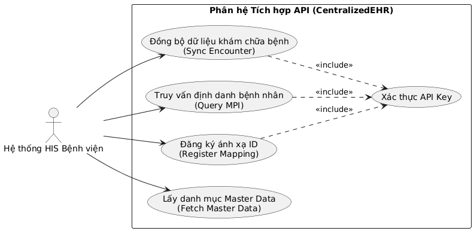
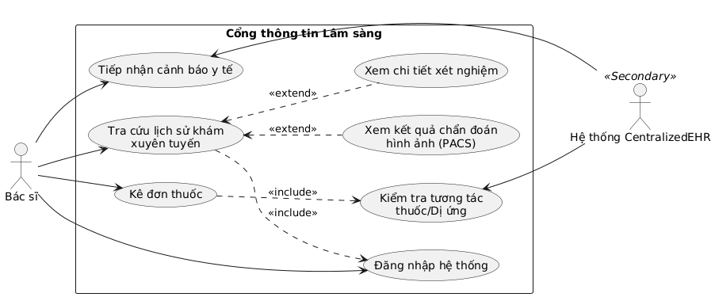
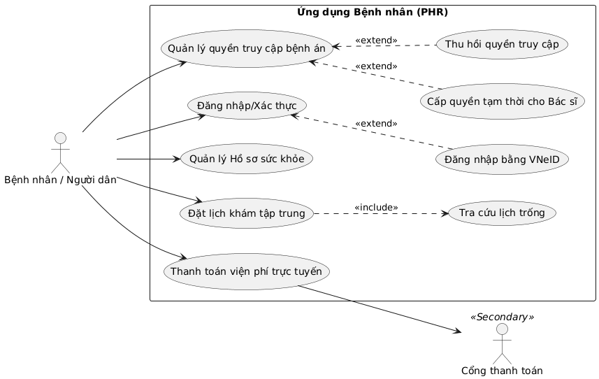
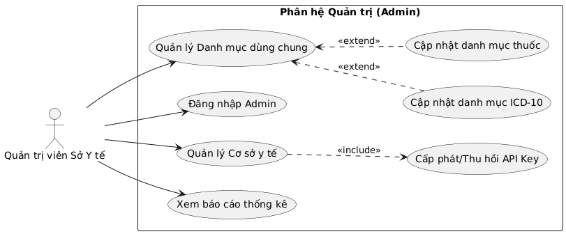

Dưới đây là phần mở rộng chi tiết cho **PHẦN I. THIẾT KẾ HỆ THỐNG TÁC NGHIỆP (OLTP)** của hệ thống CentralizedEHR, tập trung vào việc làm rõ các Use Case và thiết kế lược đồ Cơ sở dữ liệu (Database Schema) để đáp ứng trọn vẹn 2 luồng nghiệp vụ (Real-time update và Master Patient Index - MPI) mà bạn đã nêu.

### 1. Phân tích Use Case chi tiết

Hệ thống OLTP đóng vai trò là "Single Source of Truth" (Nguồn chân lý duy nhất) cho toàn bộ hoạt động y tế cấp thành phố. Các Use Case được chia theo 4 nhóm Actor (tác nhân) chính:

**A. Hệ thống HIS cục bộ của Bệnh viện (System Actor)**
Đây là tác nhân giao tiếp chủ yếu qua API (Machine-to-Machine) với trung tâm.
*   **Đồng bộ lượt khám mới (Sync Encounter):** Đẩy dữ liệu khám bệnh, xét nghiệm, kê đơn lên trung tâm qua API ngay khi bệnh nhân hoàn thành quy trình tại viện.
*   **Truy vấn định danh bệnh nhân (Query MPI):** Gửi CCCD/BHYT để lấy `patient_id` UUID của trung tâm.
*   **Đăng ký ánh xạ ID (Register Mapping):** Liên kết `local_patient_id` (mã bệnh nhân tại viện) với `patient_id` của trung tâm.

**B. Bác sĩ / Nhân viên y tế (Medical Staff)**
Sử dụng Portal của Sở Y tế hoặc xem dữ liệu được trả về trực tiếp trên màn hình phần mềm HIS của bệnh viện.
*   **Tra cứu lịch sử bệnh án xuyên tuyến:** Xem các lượt khám, lịch sử phẫu thuật, dị ứng thuốc của bệnh nhân tại *tất cả* các cơ sở y tế khác trong mạng lưới.
*   **Cảnh báo tương tác thuốc/Trùng lặp chỉ định:** Nhận cảnh báo từ hệ thống nếu kê đơn thuốc xung đột với đơn thuốc bệnh nhân đang dùng từ bệnh viện khác, hoặc chỉ định lại một xét nghiệm đắt tiền (như MRI) mà bệnh nhân vừa chụp tuần trước ở viện khác.

**C. Bệnh nhân / Người dân (Patient)**
Sử dụng Mobile App hoặc Web Portal dành cho công dân.
*   **Quản lý Hồ sơ sức khỏe cá nhân (PHR - Personal Health Record):** Xem toàn bộ lịch sử khám, sổ tiêm chủng, kết quả xét nghiệm qua các năm.
*   **Chia sẻ quyền truy cập bệnh án:** Cấp quyền (Consent management) cho phép bác sĩ tại một phòng khám tư nhân được xem hồ sơ sức khỏe của mình trong giới hạn thời gian nhất định.
*   **Đặt lịch khám tập trung:** Tìm kiếm bác sĩ, chuyên khoa và đặt lịch hẹn đến các bệnh viện trong thành phố.

**D. Quản trị viên (Sở Y tế - Admin)**
*   **Quản lý danh mục dùng chung (Master Data Management):** Cập nhật danh mục ICD-10, danh mục thuốc quốc gia (Mã ATC), danh mục vật tư y tế.
*   **Quản lý định danh cơ sở y tế:** Cấp phát API Key, quản lý thông tin các bệnh viện, phòng khám tham gia mạng lưới liên thông.

---


### 2. Lược đồ Cơ sở dữ liệu OLTP (Relational Schema)

Để đáp ứng được tốc độ truy vấn định danh (MPI) độ trễ thấp và đảm bảo tính toàn vẹn (ACID) khi các bệnh viện đẩy dữ liệu lên, lược đồ CSDL (ưu tiên sử dụng PostgreSQL) được thiết kế theo chuẩn chuẩn hóa 3NF, phân tách rõ các domain.

**A. Khối Định danh và Phân quyền (Identity & Access Management)**

| Bảng | Trạng thái | Cột quan trọng & Kiểu dữ liệu | Mô tả & Ràng buộc (Constraints/Indexes) |
| :--- | :--- | :--- | :--- |
| **patients** | Master | `id` (UUID) <br> `identity_number` (VARCHAR) <br> `insurance_code` (VARCHAR) <br> `full_name` (VARCHAR) <br> `dob` (DATE) | **PK:** `id`<br>**Unique Index:** `idx_identity_number` (phục vụ Use Case tra cứu CCCD ngay lập tức).<br>**Unique:** `insurance_code`. |
| **hospitals** | Master | `id` (UUID) <br> `code` (VARCHAR) <br> `name` (VARCHAR) <br> `level` (ENUM) | **PK:** `id`<br>**Unique:** `code` (Mã cơ sở KCB do Bộ Y tế cấp). |
| **hospital_patient_mapping** | Pivot | `patient_id` (UUID) <br> `hospital_id` (UUID) <br> `local_patient_id` (VARCHAR) | **PK:** `(patient_id, hospital_id)`<br>**FK:** `patient_id` -> patients(id)<br>**FK:** `hospital_id` -> hospitals(id). Bảng này giải quyết bài toán định danh phân tán. |
| **doctors** | Master | `id` (UUID) <br> `hospital_id` (UUID) <br> `practicing_license` (VARCHAR) <br> `specialty` (VARCHAR) | **PK:** `id`<br>**Unique:** `practicing_license` (Chứng chỉ hành nghề). |

**B. Khối Nghiệp vụ Lâm sàng (Clinical Transactions)**

Khối này nhận lượng lớn dữ liệu Insert/Update (High write-throughput) từ các HIS đẩy về.

| Bảng | Trạng thái | Cột quan trọng & Kiểu dữ liệu | Mô tả & Ràng buộc (Constraints/Indexes) |
| :--- | :--- | :--- | :--- |
| **encounters** | Transaction (Core) | `id` (UUID) <br> `patient_id` (UUID) <br> `hospital_id` (UUID) <br> `doctor_id` (UUID) <br> `visit_date` (TIMESTAMP) <br> `icd10_code` (VARCHAR) <br> `clinical_notes` (TEXT) | **PK:** `id`<br>**Index:** `idx_encounters_patient_id` (Tối ưu cho việc lấy lịch sử khám của 1 bệnh nhân).<br>Ghi nhận thông tin tổng quan 1 lượt khám. |
| **lab_results** | Transaction | `id` (UUID) <br> `encounter_id` (UUID) <br> `test_code` (VARCHAR) <br> `result_value` (VARCHAR) <br> `unit` (VARCHAR) <br> `normal_range` (VARCHAR) <br> `test_time` (TIMESTAMP) | **PK:** `id`<br>**FK:** `encounter_id` -> encounters(id).<br>Ghi nhận chi tiết từng chỉ số xét nghiệm (Máu, Sinh hóa, Nước tiểu). |
| **imaging_reports** | Transaction | `id` (UUID) <br> `encounter_id` (UUID) <br> `modality` (ENUM: XRAY, MRI, CT) <br> `pacs_link` (VARCHAR) <br> `conclusion` (TEXT) | **PK:** `id`<br>**FK:** `encounter_id`.<br>`pacs_link`: Chứa URL trỏ đến hệ thống PACS trung tâm để xem ảnh DICOM, không lưu trực tiếp ảnh vào DB. |
| **prescriptions** | Transaction | `id` (UUID) <br> `encounter_id` (UUID) <br> `drug_code` (VARCHAR) <br> `quantity` (INT) <br> `dosage_instructions` (VARCHAR) <br> `duration_days` (INT) | **PK:** `id`<br>**FK:** `encounter_id`.<br>Lưu trữ chi tiết từng loại thuốc được kê trong đợt khám. |

### 3. Lưu ý thiết kế tối ưu cho OLTP (Bổ sung cho Workflow)

*   **Soft Delete:** Trong y tế, dữ liệu không bao giờ được xóa vật lý (`DELETE`). Tất cả các bảng Transaction và Master đều cần có cột `is_deleted` (BOOLEAN) hoặc `deleted_at` (TIMESTAMP) để tuân thủ luật lưu trữ hồ sơ y tế.
*   **JSONB cho dữ liệu linh hoạt:** Một số kết quả xét nghiệm hoặc chỉ số sinh tồn (Vital signs) có cấu trúc không đồng nhất giữa các bệnh viện. Bảng `lab_results` có thể thêm 1 cột `raw_data` kiểu **JSONB** (trong PostgreSQL) để lưu trữ nguyên bản payload JSON do bệnh viện đẩy lên, phòng trường hợp cần parse thêm các trường dữ liệu phụ (metadata) sau này mà không cần alter table.
*   **Caching với Redis:** Để Workflow *Trường hợp 2* (Định danh bệnh nhân) chạy dưới 50ms, thay vì luôn query vào bảng `patients`, có thể sử dụng Redis để cache cặp `Key: identity_number` -> `Value: patient_id`.
*   **Bảo mật cấp dòng (Row-Level Security - RLS):** Nếu áp dụng PostgreSQL, kích hoạt RLS trên bảng `encounters` để đảm bảo API key của bệnh viện A chỉ có thể `UPDATE` hoặc `DELETE` (soft delete) những record do chính viện A tạo ra, ngăn chặn tình trạng ghi đè dữ liệu của bệnh viện B.


## Dưới đây là đặc tả chi tiết nội dung để bạn có thể vẽ từng biểu đồ:

### Biểu đồ 1: Phân hệ Tích hợp HIS Bệnh viện (Integration/API Subsystem)
Biểu đồ này mô tả các giao tiếp Machine-to-Machine thông qua API giữa hệ thống cục bộ của các bệnh viện và trung tâm dữ liệu thành phố.

*   **Tác nhân (Actors):** 
    *   `Hệ thống HIS Bệnh viện` (Primary Actor - Tác nhân hệ thống).
*   **Các Ca sử dụng (Use Cases) & Quan hệ:**
    *   **UC1: Đồng bộ dữ liệu khám chữa bệnh (Sync Encounter):** Đẩy dữ liệu (chẩn đoán, xét nghiệm, đơn thuốc) lên trung tâm.
        *   `<<include>>` **UC: Xác thực API Key (Authenticate API Key):** Mọi request đẩy dữ liệu đều bắt buộc phải qua bước kiểm tra quyền.
    *   **UC2: Truy vấn định danh bệnh nhân (Query MPI):** Gửi CCCD để lấy UUID bệnh nhân trên hệ thống trung tâm.
    *   **UC3: Đăng ký ánh xạ ID (Register Patient Mapping):** Liên kết mã bệnh nhân nội bộ của viện với UUID trung tâm.
    *   **UC4: Lấy danh mục Master Data (Fetch Master Data):** HIS kéo các danh mục chuẩn (ICD-10, danh mục thuốc) từ trung tâm về để đồng bộ.

### Biểu đồ 2: Cổng thông tin Lâm sàng (Clinical Portal)
Biểu đồ này tập trung vào các nghiệp vụ dành cho y bác sĩ khi họ thao tác trên Portal của Sở Y tế hoặc qua giao diện HIS đã tích hợp API tra cứu.



*   **Tác nhân (Actors):** 
    *   `Bác sĩ` (Doctor).
    *   `Hệ thống CentralizedEHR` (Secondary Actor - Xử lý logic cảnh báo).
*   **Các Ca sử dụng (Use Cases) & Quan hệ:**
    *   **UC1: Đăng nhập hệ thống (Login):** Bắt buộc đối với mọi thao tác.
    *   **UC2: Tra cứu lịch sử khám xuyên tuyến (View Cross-hospital Medical History):** Xem bệnh án của bệnh nhân tại viện khác.
        *   `<<include>>` UC1.
        *   `<<extend>>` **UC: Xem kết quả chẩn đoán hình ảnh (View PACS/DICOM):** Mở rộng nếu lượt khám đó có chụp X-Quang/MRI.
        *   `<<extend>>` **UC: Xem chi tiết xét nghiệm (View Lab Results).**
    *   **UC3: Kê đơn thuốc (Prescribe Medication):**
        *   `<<include>>` **UC: Kiểm tra tương tác thuốc/Dị ứng (Check Drug Interactions):** Hệ thống tự động kiểm tra đơn thuốc mới với tiền sử của bệnh nhân.
    *   **UC4: Tiếp nhận cảnh báo y tế (Receive Clinical Alerts):** Nhận cảnh báo (ví dụ: bệnh nhân đang dùng thuốc chống đông máu ở viện A, nay viện B định phẫu thuật).

### Biểu đồ 3: Ứng dụng dành cho Bệnh nhân (Patient Mobile App / Web Portal)
Biểu đồ này hướng tới trải nghiệm của người dân trong việc chủ động quản lý sức khỏe cá nhân (PHR).

*   **Tác nhân (Actors):** 
    *   `Bệnh nhân / Người dân` (Patient).
    *   `Cổng thanh toán` (Payment Gateway - Secondary Actor).
*   **Các Ca sử dụng (Use Cases) & Quan hệ:**
    *   **UC1: Đăng nhập/Xác thực (Login/Authentication):** 
        *   `<<extend>>` **UC: Đăng nhập bằng VNeID (SSO via VNeID):** Tùy chọn đăng nhập nhanh.
    *   **UC2: Quản lý Hồ sơ sức khỏe cá nhân (Manage PHR):** Xem lịch sử khám, đơn thuốc, lịch sử tiêm chủng.
    *   **UC3: Quản lý quyền truy cập bệnh án (Consent Management):** 
        *   `<<extend>>` **UC: Cấp quyền tạm thời cho Bác sĩ (Grant Temporary Access):** Bệnh nhân tạo mã OTP hoặc QR code để bác sĩ tuyến dưới được phép xem hồ sơ tuyến trên.
        *   `<<extend>>` **UC: Thu hồi quyền truy cập (Revoke Access).**
    *   **UC4: Đặt lịch khám tập trung (Book Appointment):**
        *   `<<include>>` **UC: Tra cứu lịch trống của cơ sở y tế (Search Availability).**
    *   **UC5: Thanh toán viện phí trực tuyến (Pay Medical Bills):**
        *   Giao tiếp trực tiếp với Tác nhân `Cổng thanh toán`.

### Biểu đồ 4: Phân hệ Quản trị Hệ thống (Admin & Master Data Management)
Biểu đồ này dành cho đội ngũ quản trị viên cấp cao tại Sở Y tế để duy trì hoạt động của toàn bộ mạng lưới.

*   **Tác nhân (Actors):** 
    *   `Quản trị viên Sở Y tế` (System Admin).
*   **Các Ca sử dụng (Use Cases) & Quan hệ:**
    *   **UC1: Đăng nhập Admin (Admin Login).**
    *   **UC2: Quản lý Danh mục dùng chung (Manage Master Data):**
        *   `<<extend>>` **UC: Cập nhật danh mục ICD-10.**
        *   `<<extend>>` **UC: Cập nhật danh mục thuốc quốc gia.**
    *   **UC3: Quản lý Cơ sở y tế (Manage Healthcare Providers):**
        *   `<<include>>` **UC: Cấp phát / Thu hồi API Key (Issue/Revoke API Key):** Cấp quyền cho HIS của một bệnh viện mới tham gia mạng lưới.
    *   **UC4: Xem báo cáo thống kê tổng quan (View System Dashboards):** Xem số lượng giao dịch API, số lượng bệnh nhân định danh thành công.

---
## Dưới đây là script SQL hoàn chỉnh để bạn có thể chạy trực tiếp trong mục **SQL Editor** của Supabase. 

Vì Supabase sử dụng **PostgreSQL** làm lõi, tôi đã tối ưu hóa script này bằng cách sử dụng các kiểu dữ liệu đặc thù của Postgres (như `UUID`, `JSONB`, `TIMESTAMPTZ`), áp dụng kỹ thuật **Soft Delete** (`deleted_at`), và chuẩn bị sẵn cấu hình **Row-Level Security (RLS)** vốn là tính năng bảo mật cốt lõi của Supabase.

### Script Tạo Bảng Cơ Sở Dữ Liệu (PostgreSQL / Supabase)

```sql
-- ==========================================
-- 0. TẠO CÁC KIỂU DỮ LIỆU (ENUMS)
-- ==========================================
CREATE TYPE hospital_level_enum AS ENUM ('CENTRAL', 'PROVINCIAL', 'DISTRICT', 'CLINIC', 'PRIVATE');
CREATE TYPE imaging_modality_enum AS ENUM ('XRAY', 'MRI', 'CT', 'ULTRASOUND', 'ENDOSCOPY');

-- ==========================================
-- 1. KHỐI ĐỊNH DANH & MASTER DATA
-- ==========================================

-- Bảng Bệnh nhân (Patients)
CREATE TABLE patients (
    id UUID PRIMARY KEY DEFAULT gen_random_uuid(),
    identity_number VARCHAR(20) UNIQUE, -- Số CCCD
    insurance_code VARCHAR(50) UNIQUE,  -- Mã BHYT
    full_name VARCHAR(255) NOT NULL,
    dob DATE NOT NULL,
    gender VARCHAR(10),
    phone_number VARCHAR(20),
    
    -- Audit & Soft Delete
    created_at TIMESTAMPTZ DEFAULT NOW(),
    updated_at TIMESTAMPTZ DEFAULT NOW(),
    deleted_at TIMESTAMPTZ
);

-- Bảng Cơ sở y tế (Hospitals)
CREATE TABLE hospitals (
    id UUID PRIMARY KEY DEFAULT gen_random_uuid(),
    code VARCHAR(50) UNIQUE NOT NULL, -- Mã do Bộ Y tế cấp
    name VARCHAR(255) NOT NULL,
    level hospital_level_enum,
    address TEXT,
    
    created_at TIMESTAMPTZ DEFAULT NOW(),
    updated_at TIMESTAMPTZ DEFAULT NOW(),
    deleted_at TIMESTAMPTZ
);

-- Bảng Bác sĩ (Doctors)
CREATE TABLE doctors (
    id UUID PRIMARY KEY DEFAULT gen_random_uuid(),
    hospital_id UUID REFERENCES hospitals(id) ON DELETE CASCADE,
    practicing_license VARCHAR(100) UNIQUE NOT NULL, -- Chứng chỉ hành nghề
    full_name VARCHAR(255) NOT NULL,
    specialty VARCHAR(255),
    
    created_at TIMESTAMPTZ DEFAULT NOW(),
    updated_at TIMESTAMPTZ DEFAULT NOW(),
    deleted_at TIMESTAMPTZ
);

-- Bảng Map định danh Bệnh nhân - Bệnh viện (MPI Mapping)
CREATE TABLE hospital_patient_mapping (
    patient_id UUID REFERENCES patients(id) ON DELETE CASCADE,
    hospital_id UUID REFERENCES hospitals(id) ON DELETE CASCADE,
    local_patient_id VARCHAR(100) NOT NULL, -- Mã bệnh nhân nội bộ tại viện (HIS ID)
    
    created_at TIMESTAMPTZ DEFAULT NOW(),
    
    PRIMARY KEY (patient_id, hospital_id)
);

-- ==========================================
-- 2. KHỐI NGHIỆP VỤ LÂM SÀNG (TRANSACTIONS)
-- ==========================================

-- Bảng Lượt khám (Encounters)
CREATE TABLE encounters (
    id UUID PRIMARY KEY DEFAULT gen_random_uuid(),
    patient_id UUID REFERENCES patients(id) ON DELETE RESTRICT,
    hospital_id UUID REFERENCES hospitals(id) ON DELETE RESTRICT,
    doctor_id UUID REFERENCES doctors(id) ON DELETE RESTRICT,
    
    visit_date TIMESTAMPTZ NOT NULL,
    icd10_code VARCHAR(20),
    symptoms TEXT,
    clinical_notes TEXT,
    
    created_at TIMESTAMPTZ DEFAULT NOW(),
    updated_at TIMESTAMPTZ DEFAULT NOW(),
    deleted_at TIMESTAMPTZ
);

-- Bảng Kết quả xét nghiệm (Lab Results)
CREATE TABLE lab_results (
    id UUID PRIMARY KEY DEFAULT gen_random_uuid(),
    encounter_id UUID REFERENCES encounters(id) ON DELETE CASCADE,
    
    test_code VARCHAR(50) NOT NULL, -- Mã dịch vụ xét nghiệm
    test_name VARCHAR(255),
    result_value VARCHAR(255) NOT NULL,
    unit VARCHAR(50),
    normal_range VARCHAR(100),
    test_time TIMESTAMPTZ,
    
    raw_data JSONB, -- Lưu payload JSON gốc từ HIS phòng hờ parse thiếu field
    
    created_at TIMESTAMPTZ DEFAULT NOW(),
    deleted_at TIMESTAMPTZ
);

-- Bảng Chẩn đoán hình ảnh (Imaging Reports)
CREATE TABLE imaging_reports (
    id UUID PRIMARY KEY DEFAULT gen_random_uuid(),
    encounter_id UUID REFERENCES encounters(id) ON DELETE CASCADE,
    
    modality imaging_modality_enum NOT NULL,
    study_date TIMESTAMPTZ,
    conclusion TEXT NOT NULL,
    pacs_link VARCHAR(500), -- Link URL xem ảnh DICOM trên hệ thống PACS
    
    created_at TIMESTAMPTZ DEFAULT NOW(),
    deleted_at TIMESTAMPTZ
);

-- Bảng Đơn thuốc (Prescriptions)
CREATE TABLE prescriptions (
    id UUID PRIMARY KEY DEFAULT gen_random_uuid(),
    encounter_id UUID REFERENCES encounters(id) ON DELETE CASCADE,
    
    drug_code VARCHAR(50) NOT NULL, -- Mã thuốc quốc gia
    drug_name VARCHAR(255) NOT NULL,
    quantity INT NOT NULL,
    dosage_instructions VARCHAR(255) NOT NULL, -- VD: "Ngày 2 lần, mỗi lần 1 viên sau ăn"
    duration_days INT,
    
    created_at TIMESTAMPTZ DEFAULT NOW(),
    deleted_at TIMESTAMPTZ
);

-- ==========================================
-- 3. TẠO INDEX ĐỂ TỐI ƯU HIỆU SUẤT ĐỌC (OLTP)
-- ==========================================

-- Tối ưu Use case 2: Tra cứu định danh bệnh nhân bằng CCCD/BHYT (Độ trễ mili-giây)
CREATE INDEX idx_patients_identity_number ON patients(identity_number) WHERE deleted_at IS NULL;
CREATE INDEX idx_patients_insurance_code ON patients(insurance_code) WHERE deleted_at IS NULL;

-- Tối ưu Tra cứu map ID từ HIS gửi lên
CREATE INDEX idx_mapping_local_id ON hospital_patient_mapping(local_patient_id, hospital_id);

-- Tối ưu Use case: Lấy lịch sử khám của 1 bệnh nhân cụ thể
CREATE INDEX idx_encounters_patient_id ON encounters(patient_id) WHERE deleted_at IS NULL;
CREATE INDEX idx_encounters_visit_date ON encounters(visit_date DESC);

-- Tối ưu Lookup các bảng con theo lượt khám
CREATE INDEX idx_lab_results_encounter_id ON lab_results(encounter_id) WHERE deleted_at IS NULL;
CREATE INDEX idx_prescriptions_encounter_id ON prescriptions(encounter_id) WHERE deleted_at IS NULL;

-- ==========================================
-- 4. KÍCH HOẠT ROW-LEVEL SECURITY (RLS) - BẢO MẬT SUPABASE
-- ==========================================
-- (Chỉ Bật RLS. Bạn sẽ cần viết các Policy cụ thể tùy thuộc vào cách bạn cấp auth token cho các Bệnh viện)

ALTER TABLE patients ENABLE ROW LEVEL SECURITY;
ALTER TABLE hospitals ENABLE ROW LEVEL SECURITY;
ALTER TABLE hospital_patient_mapping ENABLE ROW LEVEL SECURITY;
ALTER TABLE doctors ENABLE ROW LEVEL SECURITY;
ALTER TABLE encounters ENABLE ROW LEVEL SECURITY;
ALTER TABLE lab_results ENABLE ROW LEVEL SECURITY;
ALTER TABLE imaging_reports ENABLE ROW LEVEL SECURITY;
ALTER TABLE prescriptions ENABLE ROW LEVEL SECURITY;

-- Ví dụ một Policy: Bệnh viện chỉ được xem/sửa Lượt khám (Encounters) do chính họ tạo ra
-- Giả sử bạn lưu JWT claim chứa `hospital_id` của API Key
/*
CREATE POLICY "Hospitals can only access their own encounters"
ON encounters
FOR ALL
USING (hospital_id = (auth.jwt() ->> 'hospital_id')::uuid);
*/
```

### Điểm nổi bật khi triển khai trên Supabase:

1.  **`gen_random_uuid()`**: Tránh sử dụng kiểu dữ liệu số nguyên tự tăng (`SERIAL/BIGSERIAL`) cho ID trong hệ thống y tế để tránh lỗi nội suy tuyến tính (đoán được số lượng bệnh án) và hỗ trợ phân tán dữ liệu tốt hơn. Supabase hỗ trợ hàm này mặc định.
2.  **`TIMESTAMPTZ` (Timestamp with Time Zone)**: Rất quan trọng khi làm việc với API. Nó đảm bảo mọi dữ liệu thời gian các bệnh viện đẩy lên dù ở múi giờ nào cũng sẽ được lưu trữ đồng nhất theo chuẩn UTC và tự động convert về Local Time khi truy xuất.
3.  **`JSONB` trong bảng `lab_results`**: Hỗ trợ khả năng linh hoạt "Schema-less" ngay trong cơ sở dữ liệu quan hệ. Bạn có thể sử dụng sức mạnh query JSON của Supabase như: `supabase.from('lab_results').select('*').eq('raw_data->>machine_id', 'ABX-123')`.
4.  **Filtered Indexes (`WHERE deleted_at IS NULL`)**: Index chỉ được xây dựng trên những bản ghi chưa bị xóa (Soft Delete). Điều này giúp giảm kích thước Index trên RAM của Postgres, tăng tốc độ tra cứu đáng kể cho dữ liệu hợp lệ.


All APIs verified and working. Here's the complete mock data:
Table	Count	Details
patients	3	Nguyễn Văn Nam, Trần Thị Hoa, Lê Văn Hùng
hospitals	4	TW Huế, ĐK Tỉnh, Y Dược Huế, PK ABC
doctors	5	Tim mạch, Nội, Ngoại, Nhi, RHM
encounters	10	3-4 per patient across hospitals
lab_results	6	Glucose, HbA1c, CRP, Troponin, Creatinine
imaging_reports	4	X-quang, CT-scan, ECG
prescriptions	11	warfarin, aspirin, ibuprofen, metformin, steroid, etc.
appointments	9	PENDING, CONFIRMED, COMPLETED, CANCELLED
consents	9	ACTIVE, REVOKED, EXPIRED
What works for each role:
- Doctor / History — 3+ encounters per patient with labs, prescriptions, imaging
- Doctor / Interactions — aspirin + warfarin → 2 HIGH warnings; ibuprofen + warfarin → 2 HIGH warnings; paracetamol → safe
- Doctor / Cross — summary table with multi-hospital data
- Patient / Appointments — 3 per patient with varied statuses
- Patient / Consents — 3 per patient with ACTIVE, REVOKED, EXPIRED statuses